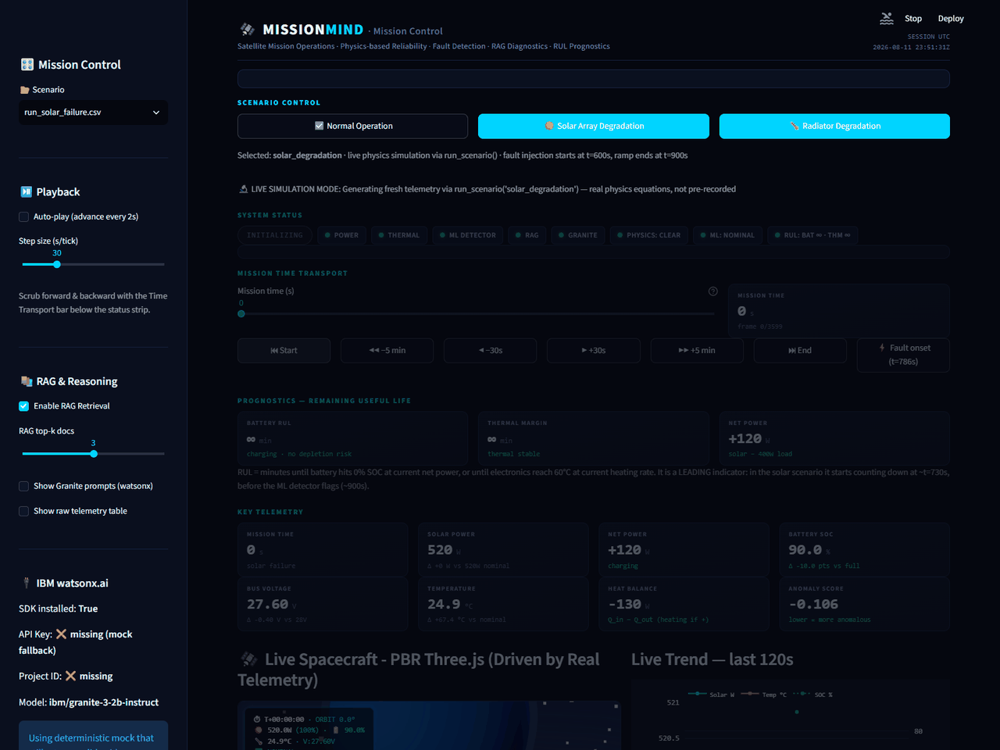
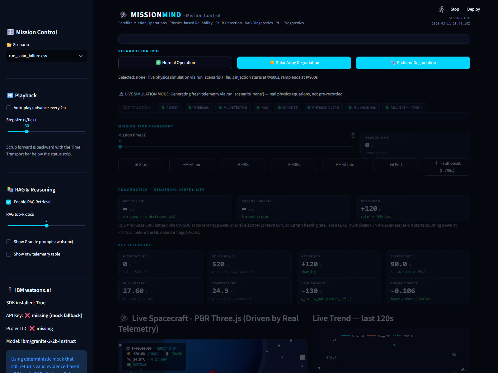
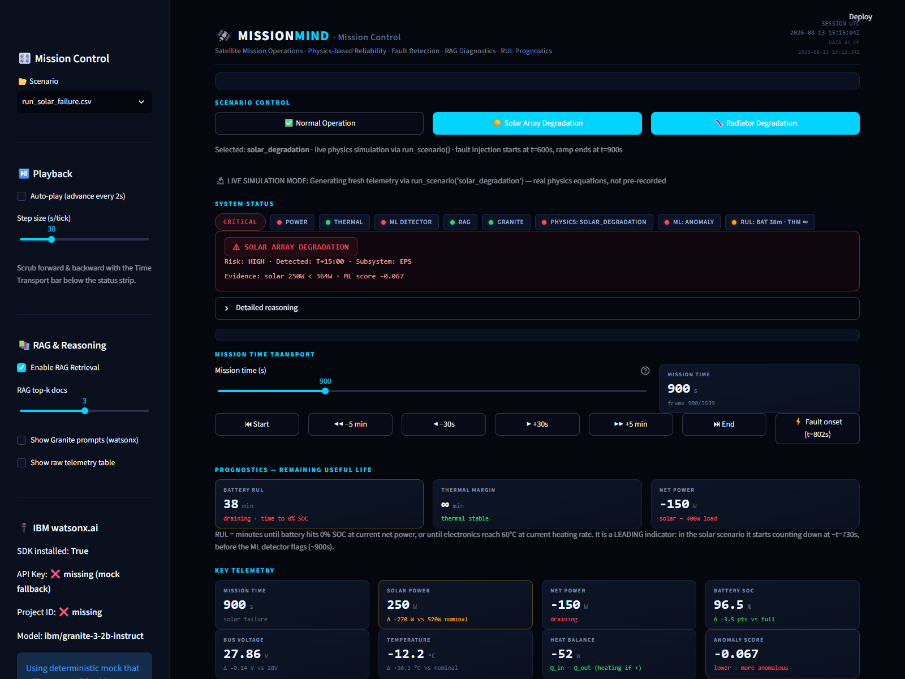
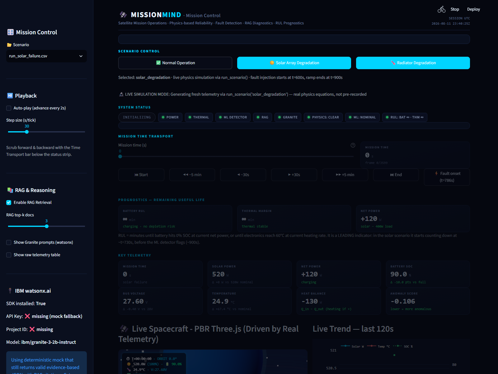
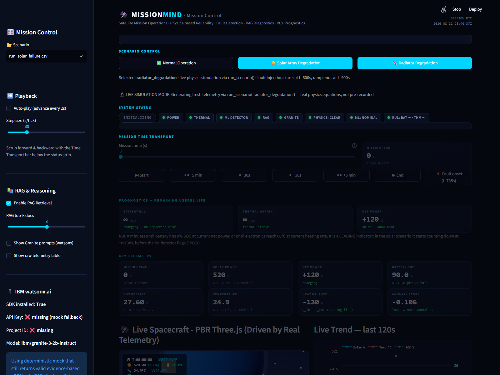
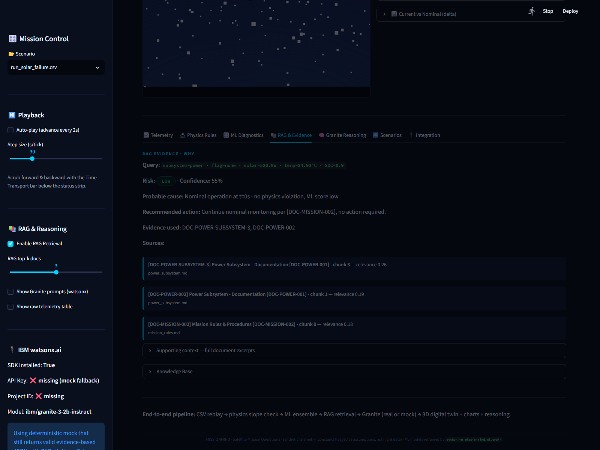

<div align="center">

# 🛰️ MissionMind

### AI for spacecraft reliability: detect faults, explain causes, estimate remaining life.

[]()
[]()
[]()
[]()
[]()
[]()

</div>

MissionMind is a satellite mission-operations stack that starts from physics and ends at an operator-facing explanation.

**Selected challenge theme:** *Advance Space Exploration with AI.* MissionMind uses AI to detect spacecraft faults earlier, explain causes with engineering evidence, and recommend corrective actions — giving operators the minutes they need to protect a mission. A simulator generates one hour of power and thermal telemetry, an ensemble of unsupervised anomaly detectors scores every sample, physics rules act as an independent second opinion, and a Granite-backed RAG layer writes the reasoning in plain language. The same pipeline feeds a Streamlit dashboard with a 3D satellite view and a React console. Validation runs against the real NASA PCoE battery dataset (B0005 / B0006 / B0007 / B0018).

---

## Demo

**2.5-minute narrated walkthrough** of the whole stack, captured live from the running app: secure multi-user authentication, live physics simulation, fault injection, ML detection, RUL, diagnostics, RAG evidence, Granite reasoning, scenario comparison, and the 3D digital twin.

<p align="center">
  <video controls width="860" src="demo/missionmind_demo.mp4"></video>
</p>

Thirty seconds of the dashboard: scrubbing the mission clock through a solar-array failure, watching telemetry degrade, the RUL chip count down, and the 3D spacecraft react on the same simulated clock.

<p align="center">
  
</p>

Captured live from the running app. `demo.gif` regenerates from `streamlit run missionmind/viz/app.py` using the Mission Time Transport bar. The narrated MP4 includes the auth flow (signup → verify → login) and regenerates with:

```bash
python scripts/capture_demo_frames.py   # live frames from the running dashboard (Playwright + system Chrome)
python scripts/make_demo_video.py       # edge-tts narration + moviepy assembly -> demo/missionmind_demo.mp4
```

---

## What's in it

Most spacecraft-AI demos showcase a single technique. This repo wires several together, and each layer is independently checkable:

| Layer | What it does | Notes |
|---|---|---|
| **Physics simulator** | Coupled power + thermal ODE solver; configurable fault injection | `mc_p = 5000 J/K`, `r_final = 0.30` toggleable via `MISSIONMIND_PHYSICS_SPEC=1` |
| **ML ensemble** | Isolation Forest, LOF, OC-SVM, MLP-AE, Hybrid DIF, FCNN, XGBOD | Held-out contamination of 0.05 |
| **RAG** | TF-IDF over a hand-curated markdown knowledge base | Top-k docs pulled live per anomaly, each chunk citeable |
| **Granite (`ibm/granite-4-h-small`)** | watsonx.ai JSON output with cited evidence | Falls back to a **tagged** deterministic mock when `WATSONX_APIKEY` is unset; the sidebar/web console show which mode is active, and a real-call failure is never disguised as IBM |
| **Streamlit + Three.js** | Mission-control dashboard with a real IBM satellite CAD | Time scrubber, RUL chip, 4-line causal alert, live physics + ML + RAG |

The full pipeline is reproducible from one command:

```bash
python missionmind/e2e_dry_run.py
```

---

## Quickstart

```bash
# 1. clone + virtualenv
git clone https://github.com/ojasvigoel598/IBM-spacecraft.git
cd IBM-spacecraft
python -m venv .venv && source .venv/bin/activate    # Windows: .venv\Scripts\activate

# 2. install (includes pyod+xgboost for XGBOD, torch for the PINN twin, gmsh for CAD export)
pip install -r requirements.txt

# 3. generate telemetry and train the ensemble (writes models/*.joblib)
python -m missionmind.simulator.run_scenarios     # 3 deterministic CSVs
python -m missionmind.ml.train                    # 2880-row hold-out split, seed 42

# 4. run the dashboard
streamlit run missionmind/viz/app.py                  # Streamlit + Three.js 3D viewer (port 8501)

# 5. optional: real Granite on watsonx.ai (everything runs on the mock without this)
cp .env.example .env                                   # then fill in WATSONX_APIKEY + WATSONX_PROJECT_ID
python -m missionmind.ai.granite_client --check        # makes ONE real call; "CHECK PASS" only if IBM actually answers (never the mock)

# web mission-control console (React + shadcn/ui + Tailwind)
python -m uvicorn missionmind.viz.api_server:app --port 8100   # JSON API on the same pipeline (real auth)
cd web && npm install && npm run dev -- --port 5173            # console at http://localhost:5173
# The console now requires an account: Sign up -> verify (dev mode shows the
# one-time token; no SMTP needed) -> Log in. Verification/reset tokens are
# returned in responses ONLY outside production (MISSIONMIND_ENV=production
# never returns them).

# 6. install the git pre-commit hook (blocks wrong author, secrets, or runtime files)
bash scripts/install-hooks.sh

# 7. verify the environment and run the tests (CI runs the same checks on every push)
python -m missionmind.check_environment && python -m pytest missionmind/tests/ -q
```

A pre-commit hook (`.githooks/pre-commit`) and the GitHub Actions workflow (`.github/workflows/ci.yml`) enforce the repo's clean-sync contract: every change is committed under the `ojasvigoel598` identity, pushed, and verified; tests must pass and must not dirty the tree; secrets are refused at commit time and scanned in CI.

Open `http://localhost:8501`. The 3D spacecraft CAD loads inside the dashboard; pick a scenario in the sidebar (Normal / Solar-Array Degradation / Radiator Degradation) and scrub the Mission Time Transport bar to jump anywhere in the 1-hour mission. The web console at `http://localhost:5173` starts with a secure login screen: sign up, verify your email (dev mode shows the token inline), log in, then access scenario summaries, anomaly alerts with physics + RAG evidence, live ingest from a virtual ESP32 edge node, and a pipeline execution trace — all behind authenticated, rate-limited, server-side-authorized endpoints.

### Environmental knobs

| Variable | Effect |
|---|---|
| `MISSIONMIND_DEMO_FAST=1` | Opts into the legacy demo-tuned constants (`mc_p=2000 J/K`, exaggerated 10% radiator fault). **Default is the physically justified spec values** (`mc_p=5000 J/K`, `r_final=0.30`); the demo values are labelled controlled injected faults, not nominal physics. |
| `WATSONX_APIKEY`, `WATSONX_PROJECT_ID` | Real `ibm/granite-4-h-small` call instead of the deterministic mock fallback. |
| `WATSONX_MODEL_ID` | Defaults to `ibm/granite-4-h-small`; any model ID on watsonx.ai works. |
| `MISSIONMIND_ALLOWED_ORIGINS` | Comma-separated browser origins allowed to call the FastAPI backend (CORS). Unset = local dev origins only (Streamlit `:8501`, Vite `:5173`, API `:8100`). Set this to your Vercel URL when deployed — wildcard CORS is never used. |
| `MISSIONMIND_ENV=production` | Secure cookies + HSTS + verification/reset tokens never returned to the client. Unset (dev) returns tokens so the demo works without SMTP. |
| `MISSIONMIND_DB_PATH` | SQLite file for users/sessions/tokens (default `missionmind/data/missionmind.db`, gitignored). |
| `MISSIONMIND_ADMIN_EMAIL`, `MISSIONMIND_ADMIN_PASSWORD` | Bootstrap admin account (created email-verified at startup). |
| `MISSIONMIND_AUTH_*`, `MISSIONMIND_API_*` | Rate-limit tuning (see `.env.example` for every knob and default). |

---

## Deploy on Vercel

The React console and the FastAPI backend deploy to Vercel as one project:
the Vite build serves the console and the Python function in `api/` serves
`/api/*` on the same origin (the console calls same-origin `/api` unless
`VITE_API_URL` is set). The six trained inference models are committed, so
scoring works with no training step.

1. Push this repo to GitHub, then import it in the Vercel dashboard.
   `vercel.json` sets the build (`npm --prefix web run build`, output
   `web/dist`) and the function config; Vercel installs the slim
   `api/requirements.txt` (no torch / pyod / xgboost / streamlit).
2. Optional: add `WATSONX_APIKEY` and `WATSONX_PROJECT_ID` as environment
   variables to enable real Granite; without them the API uses the
   deterministic mock fallback, exactly like local development.
3. Optional: set `VITE_API_URL` only if the API is hosted on a different
   origin than the console.

The Streamlit dashboard is a Python server app and does not run on Vercel;
use it locally (`streamlit run missionmind/viz/app.py`) or on Streamlit
Community Cloud.

### Security

Full details: [`missionmind/docs/SECURITY.md`](missionmind/docs/SECURITY.md).

- **Real multi-user authentication** on the FastAPI backend (`missionmind/auth/`):
  signup → email verification → login → logout, plus password reset. Passwords
  are PBKDF2-HMAC-SHA256 (310k iterations, per-user salt); sessions are opaque
  HttpOnly SameSite=Lax cookies (Secure in production) stored as digests;
  verification/reset tokens are single-use, expiring, and stored as digests.
  All flows are enumeration-safe, and every auth endpoint is rate-limited
  (login brute-force and per-IP spraying included).
- **Server-side authorization.** Every mission endpoint requires a *verified*
  account (401 anon / 403 unverified); the admin endpoint requires an admin
  role from the database — never from the request. Live edge-node streams are
  isolated per user.
- **CORS is origin-restricted, not wildcard.** Default local-dev origins;
  configured via `MISSIONMIND_ALLOWED_ORIGINS`; methods limited to
  GET/POST/OPTIONS.
- **IBM credentials stay server-side.** `WATSONX_APIKEY` / `WATSONX_PROJECT_ID`
  are read only in `missionmind/ai/granite_client.py` and are never exposed by
  `/api/health` (it returns booleans and the model ID, never the key), never
  shipped to the browser, and never logged. `.env` is gitignored and only the
  empty `.env.example` template is committed.
- **Request defence.** 16 KB body cap, strict schemas (unknown fields
  rejected), bounded query parameters, per-user/per-IP rate limits, security
  headers on every response, and generic error bodies — no stack traces,
  filesystem paths, or env values reach users; full diagnostics are logged
  server-side.
- **Secrets are refused in CI**: the pre-commit hook and the Actions workflow
  scan for key patterns and fail on any committed secret; the security job
  also runs `npm audit` and `pip-audit` dependency scans.
- **Security regression suite:** `missionmind/tests/test_auth.py` (31 tests)
  covers authn/authz boundaries, token replay/expiry, brute-force 429s,
  injection/traversal rejection, error hygiene, secret non-disclosure, CORS,
  and a concurrent-flood test — all against the real HTTP surface, no mocks.

---

## Architecture

One telemetry sample through the whole stack:

```text
       Mission Time T+0:00 --------------------------------------------------> T+01:00
                                  |                |                  |
                -------------------+----------------+-----------------+
                v run_scenario()   v solver (RK4-equivalent Euler)    v physics rules
       power load = 400 W     dSOC/dt = (net) / 3600 / 100        solar residual : solar - P_max*sun_exp ?
       solar = 520 W * sun_exp (eclipse-coupled)
                                dT/dt   = (Q_in - Q_out) / mc_p     heat-rejection residual
       bus V = 28 V @ SOC=1    eps_A    = e * A                   soc/UVLO policy: safe mode @20%,
       battery policy: UVLO trip @SOC 0, load shed, hysteresis     bus off below SOC 0 (energy-conserving)
                                  |                |                  |
                -------------------+----------------+-----------------+
                v add_derivative_features(df)   score_dataframe()    v physics_rules.*
       d_temp_dt, d_volt_dt    full detector (IsolationForest)      check_power_subsystem()
                                power detector (LOF on EPS feats)   check_thermal_subsystem()
                                thermal detector (AE on thermal)
                                ensemble = OR, score = MIN
                                  |                |                  |
                -------------------+----------------+-----------------+
                v rag.query_from_anomaly()     granite_explain()    v viz.app.py 4-line alert
       top-k docs + scores      json{diagnosis, evidence, action}   WARN - SUBSYSTEM - EVIDENCE - ACTION
       thermal_subsystem.md               citations
       power_subsystem.md
       mission_rules.md
                                  |
                -------------------+----------------+-----------------
                v viz Streamlit       v Three.js (satellite_geometry.js)  v prognosis chip
       KPIs, time-scrubber      real IBM CAD, part-level animation    "BAT 240 m / THM inf"
       t-transport, alert chip  solar arrays dim/pulse on PV fault
                                main bus glows on radiator fault
```

---

## Architecture decision records

Three decisions that shaped the system, each with the on-disk evidence that justified it.

### ADR-001: PGNN over strict PINN for production RUL/degradation scoring

**Status:** Accepted (evidence-based) · **Date:** 2026-08

**Context.** The PINN candidate was expected to win because it is physics-informed; the audit question was whether the marginal effort actually beats a feature-only model on real NASA B0005 data. Both were evaluated on the same Arm-D protocol (one cycle per row, `min(AUC,|Spearman|)` selection metric).

**Decision.** The feature-only PGNN (healthy-envelope physics gates, no physics loss term) is the production model. The strict Raissi-2019 PINN stays in the zoo as a documented research artifact, and the "(Best)" label was dropped from it. A torch-autograd twin (`pinn_torch.py`) was built to rule out finite-difference artifacts; it changed the trade-off (better |Spearman|, worse AUC) but did not overturn the verdict.

**Evidence.** Head-to-head runner: `missionmind/ml/pinn_vs_pgnn.py` (reference config at `pinn_vs_pgnn.py:42-45`, table and verdict at `pinn_vs_pgnn.py:175-200`). Stored result: `missionmind/models/pinn_vs_pgnn_b0005.json`: **PGNN `min(AUC,|Sp|) = 0.789` (AUC 0.789, Spearman -0.94) vs best strict PINN `0.285`** across the λ sweep. Label rationale: `missionmind/ml/advanced_models.py:422-427`. Multi-seed sweep that selected the PGNN config: `missionmind/ml/pinn_layer_scan.py:58`. Torch twin: `missionmind/ml/pinn_torch.py:3-14`.

### ADR-002: `MISSIONMIND_PHYSICS_SPEC=1` toggle instead of edit-and-ship

**Status:** Accepted · **Date:** 2026-08

**Context.** The spec calls for `mc_p = 5000 J/K` and a 30 % radiator end-state; those values make the simulated faults unfold too slowly to demo in an hour. Earlier versions hardcoded the demo values into the source, which was both a demo-rigging hazard and a maintenance trap (silent spec drift).

**Decision.** All physics constants live in one central module with explicit `*_SPEC` / `*_DEMO` pairs; `DEMO_FAST` defaults on and is switched by the `MISSIONMIND_PHYSICS_SPEC=1` environment variable, so no source edit is required to run the true spec. Every downstream module binds the constants at import so the toggle propagates through the whole pipeline, and a test suite asserts those bindings so a silent divergence fails loudly.

**Evidence.** Central constants + env read: `missionmind/simulator/config.py:33-39` (thermal mass) and `config.py:56-58` (radiator fraction). Binding + loud-failure tests: `missionmind/tests/test_config_seam.py:31-70` (bindings), `test_config_seam.py:73` (`test_config_failure_is_loud_not_silent`). Env knob documented in this README under Environmental knobs. One intentional deviation: tuned physics-rule thresholds, because the spec thresholds are inconsistent with the spec's own failure magnitudes, documented at `missionmind/physics_rules/rules.py` (`check_power_subsystem` / `check_thermal_subsystem`).

### ADR-003: Mock-first Granite fallback instead of hard-fail

**Status:** Accepted · **Date:** 2026-08

**Context.** The explanation layer calls `ibm/granite-4-h-small` (override with `WATSONX_MODEL_ID`) on watsonx.ai. Credentials are not guaranteed in a demo or CI environment, and a hard-fail would break the entire dashboard whenever the API is unreachable. The system must stay operational without the LLM, and must never present mock output as real.

**Decision.** `generate_explanation(strict=False)` (dashboard default) tries the real watsonx call only when the SDK and both credentials are present; on any failure it falls back to a deterministic rule-based mock that always returns schema-valid JSON and is **explicitly tagged `source="mock"`**. The UI surfaces the fallback honestly (sidebar shows `API Key: missing (mock fallback)`; the web console shows GRANITE LIVE only after a real call succeeded). `generate_explanation(strict=True)` — used by `python -m missionmind.ai.granite_client --check` — requires credentials AND a successful real call and raises on failure; it never substitutes the mock, so the smoke test can only pass when IBM actually answered.

**Evidence.** Fallback policy: `missionmind/ai/granite_client.py` (`_call_watsonx_granite` is the only real-network path; `generate_explanation` gates on `WATSONX_AVAILABLE` + credentials and tags the mock; `strict=True` raises `GraniteRequestError`). State machine: `check_config()`/`granite_status()` (MOCK / REAL_READY / REAL_FAILED) surfaced by `/api/health` and the web console. Behavior tests: `missionmind/tests/test_granite_nominal.py` (nominal/solar branches, `ml_flag` guard, strict-never-mocks, mock tagging, JSON parsing, mode contract).

---

## Visual tour

Captured from the running Streamlit dashboard at 1600x1200. Each image shows a real MissionMind control state.

### Mission-control overview



### 3D spacecraft (Three.js, real IBM satellite CAD)



### Solar-array degradation



### Radiator degradation



### RAG alert with engineering citations



---

## Validation evidence

Every number below is reproduced from the code on disk.

### 1. Real NASA PCoE battery benchmark (Arm-D protocol on B0005)

```
PGNN (64,32,16) reground a=0.30   (multi-seed robust)        AUC = 0.786 +/- 0.009 (6 seeds)
  Spearman rho  = 0.950 +/- 0.028  (sign-correct)
  Win-count     = 2 / 6 seeds among top-5 configs
Source: missionmind/ml/pinn_seed_robustness.py
```

### 2. Simulator fault-injection (run_normal / run_solar_failure / run_radiator_failure)

```
solar failure          FPR_strict 100-600s   = 0.000
                       flag_rate 900-3600s    = 1.000
                       post900_F1              ~ 1.00
radiator failure       FPR_strict 100-600s   = 0.000
                       flag_rate 900-3600s    = 1.000
                       post900_F1              ~ 1.00
normal                 FPR_strict 100-600s   = 0.000
                       flag_rate 900-3600s    = 0.093   (8 % burn-in drift, expected)
Source:  missionmind/ml/detect.py + missionmind/_lifecycle_assertions.py
```

### 3. Physics rule checks under load

```
test_rules     PASS all rule tests
test_physics   PASS SOC plateau 1.0, V 28 V, T-eq 223 K
test_ml_metrics  PASS cycle-level + predictive-horizon + fresh-capacity guard
Source: missionmind/tests/test_physics.py
        missionmind/physics_rules/test_rules.py
```

### 4. Raissi 2019 strict PINN: honest non-result

The repo includes a strict physics-informed NN (data loss + λ-weighted physics residual `(dC/dn_NN - (-a*C))^2`) benchmarked against the feature-only PGNN on the same B0005 scan:

```
PGNN        AUC 0.789   |Sp| 0.939   min(AUC,|Sp|)= 0.789
PINN(l=0.5) AUC 0.349   |Sp| 0.227   min(AUC,|Sp|)= 0.227
```

The strict PINN does not beat the feature-only PGNN on this benchmark; the composite loss collapses discrimination once the network fits the ODE. The production model is the feature-only PGNN, and the PINN is labeled as a research artifact, not as "best". Result on disk: `missionmind/models/pinn_vs_pgnn_b0005.json`.

A PyTorch-autograd twin of the PINN (`missionmind/ml/pinn_torch.py`) uses the same composite loss with `dC/dn_NN` from `torch.autograd.grad` (real backpropagation, Adam + cosine schedule) instead of finite differences. On the same B0005 protocol it changes the AUC/|Spearman| trade-off (higher |Sp|, lower AUC) but does not overturn the verdict, so it stays an experimental drop-in rather than a replacement.

---

## CAD assets

The spacecraft in the 3D viewer is a real Fusion-exported IBM satellite (not a procedural placeholder). All three exchange formats ship in the repo so visitors can view or download it without the code:

| Format | File | Use |
|---|---|---|
| **OBJ** | [`missionmind/viz/components/models/ibm_satellite.obj`](missionmind/viz/components/models/ibm_satellite.obj) | Source mesh (42,878 verts / 85,740 tris), what Three.js renders |
| **STL** | [`missionmind/viz/components/models/ibm_satellite.stl`](missionmind/viz/components/models/ibm_satellite.stl) | Binary STL; GitHub renders this inline in the browser (click to orbit/zoom) |
| **STEP** | [`missionmind/viz/components/models/ibm_satellite.step`](missionmind/viz/components/models/ibm_satellite.step) | AP203 faceted BRep; opens in Fusion / SolidWorks / FreeCAD |

> The STL and STEP are generated from the OBJ by `missionmind/viz/components/obj_to_step_stl.py` (gmsh mesh kernel + hand-rolled ISO-10303-21 writer; watertightness and winding are verified before export).

---

## Granite grounding

Granite is not used as an anomaly detector. The ML ensemble + physics rules are deterministic and frozen at every cursor position. Granite is invoked only for the human-readable explanation:

1. The retriever sees the current anomaly row plus the physics-rule hits.
2. It builds the query around the detected physics signature and returns the
   top-k chunks from `missionmind/ai/knowledge_base/*.md`, scored by TF-IDF
   and **metadata-scoped** to the systems the query names (power / thermal /
   mission) plus the shared telemetry dictionary. A query that names no known
   system gets NO evidence — the system refuses rather than guesses.
3. The system prompt declares the contract: output JSON with `diagnosis, evidence, recommended_action, risk` and `citations` arrays linking back to the chunks, treats retrieved text strictly as DATA (never instructions), and labels each passage with its source file.
4. `ibm/granite-4-h-small` (override with `WATSONX_MODEL_ID`) fills that contract; the dashboard parses and displays the result.

If `WATSONX_APIKEY` is not set, the sidebar shows `API Key: missing (mock fallback)` and the function uses a deterministic mock that returns the same JSON shape with the RAG chunks surfaced as citations, so it is always obvious whether the output came from a real LLM call or the mock.

The retrieval layer is validated **independently of Granite** (no credentials,
no network): a golden dataset of 18 typed engineering questions measures
Recall@k / Precision@k / MRR / nDCG, adversarial attacks (wrong-document,
conflicting sources, prompt injection, unit confusion) are defended, and the
full RAG suite must pass **10 consecutive clean runs**
(`python -m missionmind.ai.rag_validation --runs 10`). Full methodology,
measured scores and honest limitations:
[`missionmind/docs/RAG_EVALUATION.md`](missionmind/docs/RAG_EVALUATION.md).

---

## What this is (and isn't)

Implemented:

- **Energy-conserving EPS**: `dSOC/dt = (P_solar*deg*sun_exposure - P_load) / (E_cap_Wh * 3600)` — solar is coupled to the orbital eclipse state (umbra → ~0 W, smooth penumbra); the battery follows a first-order policy (safe mode below 20% SOC, bus trip at SOC 0, hysteresis recharge) so **no energy is ever consumed at SOC=0**.
- **First-order LEO thermal environment**: direct solar, Earth albedo and Earth IR absorbed on the bus (eclipse-modulated) plus internal dissipation vs Stefan–Boltzmann rejection; `dT/dt = (Q_in - Q_out) / mc_p` with `mc_p` and `r_final` toggled per spec on demand.
- **Fault injection**: solar degradation ramps `P_solar_max -> 0.48x` over `t = 600 -> 900 s`; radiator degradation ramps `e*A -> r_final * nominal`.
- **Real IBM satellite CAD** (`satellite_geometry.js`): part-level fault animation, solar arrays dim + pulse on PV failure, main bus glows on radiator failure.
- **Detector / physics-rule co-design**: every flagged row is visible in the alert card with the exact feature column that drove the flag.
- **Real orbital physics**: analytical two-body propagation (Kepler's equation solved by Newton-Raphson) in 3D ECI coordinates, a conical shadow eclipse model (umbra / penumbra / sun-exposure factor), and a validated numerical extension point (`simulator/propagation.py`: RK4 + adaptive DOPRI5 + J2). The Three.js orbit view and HUD angle are driven by the propagated state, and the eclipse state is consumed by the physics rules. Method evaluation and measurements in `missionmind/docs/ORBITAL_PROPAGATION.md`.

Not implemented:

- **Live ingest is real but virtual**: a simulated ESP32-class edge node publishes the same physics over a real JSON-lines TCP socket (MQTT when paho-mqtt is installed); the ensemble scores the stream as it arrives. A physical ESP32/RPi can replace the virtual node with the same wire format (`missionmind/telemetry/`).
- **The strict PINN does not beat the feature-only PGNN**; this is documented as a result, not hidden.
- **IBM Bob**: account not yet created; genuine usage examples will be documented after account creation.
- **LangChain/LangFlow/Vector DB**: intentionally not used; TF-IDF is sufficient for 31 chunks (see Technology Stack Decisions above).

---

## Project map

```
missionmind/
|-- ai/                     IBM watsonx.ai client + RAG retriever + prompt templates
|   |-- granite_client.py   real + mock wrappers (strict smoke-test mode)
|   |-- rag.py              metadata-scoped TF-IDF over a 4-file KB incl. telemetry dictionary
|   |-- rag_eval.py         golden dataset + Recall@k/MRR/nDCG evaluation harness
|   |-- rag_validation.py   10-consecutive-clean-runs reproducibility gate
|   +-- prompts.py          SYSTEM / RAG / EVIDENCE prompt contracts
|
|-- simulator/              coupled power + thermal ODE solver, fault injection
|   |-- config.py           central constants + DEMO/SPEC flag toggleable via env
|   |-- thermal.py          dT/dt = (Q_in - Q_out) / mc_p  (RK4-equivalent Euler)
|   |-- failures.py         solar + radiator fault ramps
|   |-- run_scenarios.py    @ 1 Hz over 3600 s -> DataFrame
|   +-- physics_verification.py    manual hand-calc vs sim
|
|-- telemetry/              the "electronics side" of the twin: live ingest
|   |-- edge_node.py        virtual ESP32-class device -> physics-derived frames
|   |-- ingest.py           JSON-lines TCP server/client + MQTT (paho) + LiveScorer
|   |-- frame.py            wire schema (identical to run_scenarios output)
|   +-- run_edge_demo.py    CLI demo: stream 1000 frames through the ensemble
|
|-- physics_rules/          Spec section 6 rule checks (eclipse-aware solar residual, heat-rejection residual)
|   +-- rules.py            check_power_subsystem, check_thermal_subsystem
|
|-- ml/                     detector zoo + scoring + audit infrastructure
|   |-- train.py            ensemble (full + power + thermal) -> 3 .joblibs
|   |-- detect.py           score_dataframe(): UNSUP + ENSEMBLE, MIN-of-3 score + source attribution
|   |-- advanced_models.py  IF / LOF / OC-SVM / MLP-AE / Hybrid DIF / FCNN / XGBOD / PINN
|   |-- metrics.py          9 metrics + confusion-matrix helpers
|   |-- prognostics.py      NASA RUL on the real .mat files (offline)
|   |-- pinn_*.py           Raissi strict PINN + torch-autograd twin + multi-seed sweep + head-to-head
|   +-- compare.py          threshold-independent + dependent metrics table
|
|-- tests/                  30 TDD suites, all pass
|   |-- test_drift.py       KS drift test
|   |-- test_ml_metrics.py  predictive-horizon, fresh-capacity, cycle-level
|   |-- test_physics.py     SOC plateau, V, T-eq
|   +-- *.py
|
+-- viz/                    Streamlit dashboard + Three.js mission-control viewer
    |-- app.py              single-file dashboard
    |-- api_server.py       FastAPI JSON API: same scored scenarios + live edge-node stream + model zoo
    +-- components/         satellite_geometry.js + models/{ibm_satellite.obj,.stl,.step} + obj_to_step_stl.py

web/                        React 19 + Vite + Tailwind v4 + shadcn/ui mission-control console
    |-- src/App.tsx         KPI grid, SVG telemetry charts, time scrubber, alert evidence, live ingest
    +-- src/components/ui/  shadcn/ui components (Base UI flavour)
```

---

## Testing

```bash
# 30 regression suites (TDD) - run them all with pytest:
pytest

# or one at a time, e.g.:
python -m missionmind.tests.test_physics
python -m missionmind.tests.test_ml_metrics
python -m missionmind.tests.test_granite_nominal
python -m missionmind.tests.test_config_seam
python -m missionmind.tests.test_prognostics
python -m missionmind.tests.test_drift
python -m missionmind.tests.test_mlpae_tighten
python -m missionmind.tests.test_pinn_raissi
python -m missionmind.tests.test_telemetry_ingest
python -m missionmind.tests.test_api_server
python -m missionmind.physics_rules.test_rules
```

End-to-end run with the project interpreter:

```bash
python missionmind/e2e_dry_run.py
# regenerates scenarios, exercises the training pipeline (rebuild of the
# committed inference artifacts is skipped unless --retrain), runs all ML
# detectors, walks the RAG, exercises the Granite client (real + mock),
# validates the dashboards.
```

Fresh-checkout behaviour:

- The suite auto-regenerates the three gitignored scenario CSVs
  (`missionmind/data/run_*.csv`) at session start via
  `missionmind/tests/conftest.py`, so a fresh clone runs green without
  committing generated telemetry (each solve takes ~0.3 s).
- Tests that need the real NASA `.mat` files (PINN on B0005, RUL
  bootstrap interval) skip with a clear reason until the data is present
  in `missionmind/data/real_nasa/`; with the data downloaded they run in
  full. Download the official NASA BatteryAgingARC-FY08Q4 files with
  `python -m missionmind.ml.download_nasa_data` (stdlib-only and
  idempotent; see `missionmind/docs/NASA_REAL_VALIDATION.md`).
- CI runs the same gate and suite inside a fresh venv on every push. It
  downloads and caches the NASA `.mat` files (via `actions/cache`, keyed
  on the download script), so the real-data tests execute rather than
  skip. A second job builds the React console and validates the demo
  video and captions, and a third verifies pushed commits are authored by
  the pinned identity.
- `main` has branch protection: the two CI checks (tests + clean tree,
  frontend build + demo assets) must pass before a pull request merges.
  Direct pushes by the repo owner are not blocked, matching this repo's
  workflow.

---

## IBM watsonx.ai integration

| What | Where |
|---|---|
| Model ID | `ibm/granite-4-h-small` (override with `WATSONX_MODEL_ID`) |
| Auth | `WATSONX_APIKEY` (env) + `WATSONX_PROJECT_ID` (env) |
| Code | `missionmind/ai/granite_client.py`: `_call_watsonx_granite()` is the only real-network path |
| Mock | `generate_explanation(...)` falls back to a deterministic mock that still returns schema-correct JSON with RAG citations; the sidebar shows which mode is active |
| Verify a key | `python -m missionmind.ai.granite_client --check` reports config, then makes ONE real call — it can only report CHECK PASS if IBM actually answered (strict mode never substitutes the mock) |
| RAG corpus | `missionmind/ai/knowledge_base/{power_subsystem, thermal_subsystem, mission_rules, telemetry_reference}.md` (the telemetry dictionary grounds every variable before reasoning) |
| Citations | Granite is asked to fill a `citations[]` array linking each claim to a TF-IDF chunk, so each dashboard claim is traceable to a file |

---

## Technology Stack Decisions

This project intentionally uses a **minimal technology stack** that provides the strongest measurable engineering capability. Full analysis: [`missionmind/docs/TECHNOLOGY_STACK_REVIEW.md`](missionmind/docs/TECHNOLOGY_STACK_REVIEW.md).

| Technology | Decision | Reason |
|---|---|---|
| TF-IDF RAG | **KEEP** | 31 chunks from 4 files; Recall@k=0.944, MRR=0.935; no vector DB needed |
| LangChain | **DO NOT IMPLEMENT** | Adds ~50MB for zero retrieval improvement on this corpus |
| LangFlow | **DO NOT IMPLEMENT** | No complex orchestration needed; pipeline is transparent in Python |
| Vector databases | **DO NOT IMPLEMENT** | 31 chunks fit in memory; no infrastructure needed |
| Dense embeddings | **OPTIONAL FUTURE WORK** | Benchmark when KB grows beyond ~100 chunks |
| IBM watsonx/Granite | **IMPLEMENTED** | Real SDK, honest mock fallback, ready for credentials |

---

## IBM Bob Status

**⚠️ PENDING — Account not yet created.**

IBM Bob is the required development tool for the August AI Builders Challenge. The user has not yet created an IBM Bob account or configured watsonx/Granite credentials.

**What exists:**
- Real `ibm-watsonx-ai` SDK integration (code-ready)
- Environment variables configured (`WATSONX_APIKEY`, `WATSONX_PROJECT_ID`)
- Strict smoke-test mode (`python -m missionmind.ai.granite_client --check`)
- Honest mock fallback when no credentials are present

**What must be done after account creation:**
1. Create IBM Cloud account → enable watsonx.ai
2. Create a watsonx project → get project ID
3. Generate an API key → add to `.env`
4. Run `python -m missionmind.ai.granite_client --check` to verify
5. Document genuine Bob usage examples in this README

**Do not fabricate Bob usage evidence.** Once the user actually uses Bob, genuine examples will be documented here.

---

## Status (2026-08)

- Real NASA PCoE battery benchmark wired (Arm-D protocol, multi-seed robust)
- Ensemble coherence under inspector (flag=1 implies score<0 by construction)
- 4-line causal narrative (WARN -> SUBSYSTEM -> EVIDENCE -> ACTION)
- Granite client + RAG integrated with honest mock fallback
- Real Kepler propagator: analytical two-body + conical shadow eclipse in the runtime telemetry; the eclipse state is coupled into the power/battery/thermal solve (one source of truth drives orbital telemetry, solar power, battery and the rules layer), with a validated numerical extension point (RK4 / adaptive DOPRI5 / J2) for perturbed runs (see `missionmind/docs/ORBITAL_PROPAGATION.md`)
- Live telemetry ingest: virtual IoT edge node -> TCP/MQTT -> live ensemble scoring (`missionmind/telemetry/`)
- Session persistence: dashboard resumes at last-viewed scenario/time after restart, plus login auto-start (`scripts/install_autostart.ps1`)
- PINN vs PGNN result disclosed on disk and in this README

---

## Contributing

PRs welcome. The two highest-leverage follow-ups:

1. Higher-fidelity perturbed propagation in the runtime solve (J2/drag are validated in `simulator/propagation.py` but the live telemetry still uses the analytical two-body baseline).
2. Physical edge hardware: an ESP32/RPi running the same JSON-lines wire format the virtual node publishes, replacing `VirtualEdgeNode` in `run_edge_demo.py`.

Both are tracked in `CHANGES.md` with risk / impact / effort annotations.

## License

MIT. See [LICENSE.md](LICENSE.md).
