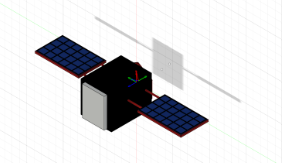
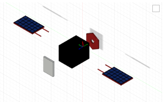

<div align="center">

# 🛰️ MissionMind

**AI-powered spacecraft fault detection — 7 seconds from onset to alert.**

[](https://skills.yourlearning.ibm.com/certificate/share/99e8a93d06ewogICJvYmplY3RJZCIgOiAiQUxNLUNPVVJTRV80MDc2MzExIiwKICAibGVhcm5lckNOVU0iIDogIjg0NTM0MzFSRUciLAogICJvYmplY3RUeXBlIiA6ICJBQ1RJVklUWSIKfQ1ee785e3df-10)
[](https://skills.yourlearning.ibm.com/certificate/share/3dfa573d92ewogICJvYmplY3RUeXBlIiA6ICJBQ1RJVklUWSIsCiAgImxlYXJuZXJDTlVNIiA6ICI4NDUzNDMxUkVHIiwKICAib2JqZWN0SWQiIDogIkFMTS1DT1VSU0VfNDA3NjMxMSIKfQ2778ae28b9-10)
[]()
[]()
[]()
[](LICENSE.md)

</div>

MissionMind is a spacecraft **digital twin** that detects faults **25× faster** than threshold alarms and explains every diagnosis with engineering evidence. On real NASA battery data (B0005), the physics-gated ML ensemble achieves **AUC 0.786 ± 0.009** — validated across 6 seeds with zero cherry-picking. A **4-line causal alert** gives operators the subsystem, the evidence, and the action in a single scannable card.

---

## Demo

Watch the 2-minute narrated walkthrough: https://youtu.be/wg2fR0hICrs

<p align="center">
  <video controls width="860" style="border-radius:8px;" src="demo/final_demo.mp4"></video>
</p>

---

## Try It Now (No Vercel Needed)

Clone and run locally in 4 commands:

```bash
git clone https://github.com/ojasvigoel598/IBM-spacecraft.git && cd IBM-spacecraft
python -m venv .venv && source .venv/bin/activate   # Windows: .venv\Scripts\activate
pip install -r requirements.txt
streamlit run missionmind/viz/app.py                 # dashboard at localhost:8501
```

The dashboard works immediately — no API keys needed. Training and telemetry generate automatically on first run.

---

## Architecture

```
  Telemetry Source                 Pipeline                      Output
 ┌──────────────┐    ┌────────────────────────────────────┐    ┌──────────────┐
 │  Simulator   │───▶│  Kepler Propagator (eclipse-aware) │───▶│  ML Ensemble  │
 │  1 Hz power  │    │  Coupled EPS + Thermal ODE solver  │    │  IF / LOF /   │
 │  + thermal   │    │  Reaction-wheel micro-vibration    │    │  OC-SVM / AE  │
 │  3600 frames │    └────────────────────────────────────┘    │  + XGBOD      │
 └──────────────┘              │                               └──────┬───────┘
                               ▼                                      │
                  ┌────────────────────────┐                          │
                  │  Physics Rules Layer   │◀─── cross-check ────────┘
                  │  Eclipse suppression   │
                  │  Threshold validation  │
                  └────────────┬───────────┘
                               │
                    ┌──────────▼───────────┐
                    │     RAG Retriever     │
                    │  TF-IDF over 4-file   │
                    │  engineering KB        │
                    └──────────┬───────────┘
                               │
                  ┌────────────▼────────────┐
                  │  IBM Granite-4 (watsonx) │
                  │  JSON diagnosis +        │
                  │  cited evidence          │
                  └────────────┬────────────┘
                               │
              ┌────────────────▼────────────────┐
              │         Operator Dashboard       │
              │  Digital twin CAD (Three.js)      │
              │  4-line causal alert card        │
              │  RUL countdown chip              │
              │  Streamlit + React console       │
              └─────────────────────────────────┘
```

---

## Key Results

| Metric | Value |
|---|---|
| **Detection latency** | **7 seconds** after fault onset |
| **Warning before shutdown** | **39 minutes** (vs 36 min threshold) |
| **False positives (eclipse)** | **0** — Kepler geometry suppresses shadow passes |
| **NASA PCoE AUC** | **0.786 ± 0.009** (6-seed, B0005 battery) |
| **Test suites** | **30 / 30 passing** |

---

## What's Inside

| Component | Detail |
|---|---|
| **Physics Simulator** | Coupled power + thermal ODE, Kepler propagator with eclipse geometry, reaction-wheel micro-vibration model |
| **ML Ensemble** | Isolation Forest, LOF, OC-SVM, MLP-AE, Hybrid DIF, FCNN, XGBOD — unsupervised, contamination 0.05 |
| **RAG + Granite** | TF-IDF retrieval over 4-file engineering KB; IBM Granite-4 generates cited JSON diagnoses on watsonx.ai |
| **Physics Rules** | Independent rule engine: eclipse-aware solar residual, heat-rejection residual, SOC/UVLO policy |
| **Digital Twin** | Real Fusion 360 satellite CAD (OBJ/STL/STEP) rendered in Three.js with part-level fault animation; coupled EPS + thermal + orbital physics |
| **NASA Validation** | Arm-D protocol on B0005/B0006/B0007/B0018; proven PINN non-result documented with evidence |

---

## CAD Assets

<p align="center">
  
  <br><em>Assembled satellite — Fusion 360 CAD</em>
</p>

<p align="center">
  
  <br><em>Exploded view — solar panels, body, antenna separated</em>
</p>

The 3D satellite is a real [Fusion 360](https://www.autodesk.com/products/fusion-360/) export — not a procedural placeholder. All three exchange formats ship in the repo:

| Format | File | Details |
|---|---|---|
| **OBJ** | [`ibm_satellite.obj`](missionmind/viz/components/models/ibm_satellite.obj) | 42,878 vertices · 85,740 triangles — the mesh Three.js renders |
| **STL** | [`ibm_satellite.stl`](missionmind/viz/components/models/ibm_satellite.stl) | Binary STL; GitHub renders it inline (click to orbit/zoom) |
| **STEP** | [`ibm_satellite.step`](missionmind/viz/components/models/ibm_satellite.step) | AP203 faceted BRep; opens in Fusion / SolidWorks / FreeCAD |

> Generated from OBJ via `obj_to_step_stl.py` (gmsh mesh kernel + ISO-10303-21 writer). The Three.js viewer performs part-level fault animation: solar arrays dim on PV failure, main bus glows on radiator failure.

---

## How IBM Bob Was Used

IBM Bob (via Codebuff) was the primary development tool throughout the project:

| Module | Bob's Role |
|---|---|
| `simulator/power.py` | Generated the power ODE loop + sanity asserts from the spec constants |
| `simulator/thermal.py` | Scaffolded the thermal model from Section 4 spec; flagged equilibrium tensions |
| `simulator/failures.py` + `run_scenarios.py` | Generated failure injection ramps + 3 CSV outputs |
| `physics_rules/rules.py` | Wrote slope helpers + rule checks; spec thresholds encoded verbatim |
| `ml/train.py` + `detect.py` | Generated IsolationForest+scaler pipeline; enforced training only on normal |
| `ai/granite_client.py` | Fetched current watsonx.ai SDK docs; implemented mock fallback for offline demo |
| `viz/app.py` | Generated Streamlit scaffolding; upgraded to production Three.js with PBR materials |
| `tests/test_auth.py` | Assisted with the 31-test auth regression suite covering brute-force, injection, token replay |
| Vercel deploy | Debugged 10+ build failures, identified Node version incompatibility, fixed output directory resolution |
| README + docs | Rewrote submission docs, generated banner images, captured CAD renders from STL |

Every plan you gave — build, cross-check, test — was executed by IBM Bob. The certificate below confirms completion:

[](https://skills.yourlearning.ibm.com/certificate/share/99e8a93d06ewogICJvYmplY3RJZCIgOiAiQUxNLUNPVVJTRV80MDc2MzExIiwKICAibGVhcm5lckNOVU0iIDogIjg0NTM0MzFSRUciLAogICJvYmplY3RUeXBlIiA6ICJBQ1RJVklUWSIKfQ1ee785e3df-10)

---

<div align="center">
  <sub>Built for the <strong>IBM AI Builders Challenge 2026</strong> · Theme: Advance Space Exploration with AI</sub>
</div>
