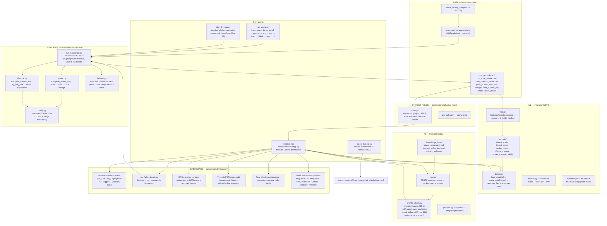

# MissionMind — Execution Flowchart & File Map

> Workspace: `C:\Users\ojasv\Downloads\workspace-019fe20c-55dc-74ce-ada7-84f3b764513c`
> Renders as a diagram on GitHub (Mermaid) — or read the ASCII version below.

---

## 1. Overview (ASCII)

```
run_demo.sh (1-command demo)  ·  e2e_dry_run.py (verify chain ×2)  ·  streamlit run viz/app.py (UI)
        │
        ▼
┌─────────────────────────────── SIMULATOR ─ missionmind/simulator ───────────────────────────────┐
│  run_scenarios.py  (orchestrator, 3600 s × 3 scenarios)                                          │
│     power.py   (solar → load → SOC → voltage)     config.py  (constants: 520 W, 100 Wh, …)      │
│     thermal.py (Q_in/Q_out → temperature)          failures.py (degradation ramps at 600–900 s) │
└───────────────────────────────┬─────────────────────────────────────────────────────────────────┘
                                │ writes 3 CSVs
                                ▼
                  missionmind/data/run_{normal,solar_failure,radiator_failure}.csv
                                │
        ┌───────────────────────┼──────────────────────────┐
        ▼                       ▼                          ▼
physics_rules/rules.py    ml/train.py                data/nasa_grounding.py
(hand physics checks)     (IsolationForest ensemble) (NASA B0005 sample →
        │                 trains 6 .joblib models)   grounded_parameters.json)
        │                       │
        │                       ▼
        │                 ml/detect.py — score_dataframe() loads joblibs, scores each row
        │                       │
        │                       ▼
        │                 ai/rag.py — TF-IDF over ai/knowledge_base/*.md (3 docs)
        │                       │
        │                       ▼
        │                 ai/granite_client.py — evidence JSON (mock fallback OR real watsonx)
        │                       │
        └───────────────┬───────┴───────────────────────┐
                        ▼                               ▼
         viz/app.py  (Streamlit Mission Control)   standalone 3D demo
         └─ Three.js spacecraft (components/       (components/three_
            three_spacecraft_standalone.html)       spacecraft_standalone.html)
```

---

## 2. Mermaid flowchart (renders on GitHub)



---

## 3. Main files and responsibility

| # | File | Responsibility | Called by |
|---|------|----------------|-----------|
| 1 | `run_demo.sh` | One-command demo: install deps, ground, simulate, test, train, RAG, launch Streamlit (:8501) + Three.js (:8000) | user |
| 2 | `missionmind/e2e_dry_run.py` | Runs the full chain twice with no manual fixes — clean-startup proof | user |
| 3 | `missionmind/simulator/run_scenarios.py` | **Orchestrator** — couples power + thermal per second, writes the 3 telemetry CSVs | 1, 2 |
| 4 | `missionmind/simulator/power.py` | Electrical model: solar → load → SOC → voltage | 3, app live-inject |
| 5 | `missionmind/simulator/thermal.py` | Thermal model: Q_in/Q_out → temperature, equilibrium | 3, app live-inject |
| 6 | `missionmind/simulator/failures.py` | Failure ramps: solar 520→249 W, radiator epsA→10% | 3 |
| 7 | `missionmind/simulator/config.py` | All constants (520 W, 100 Wh, V range, thresholds) | 3–6, rules |
| 8 | `missionmind/physics_rules/rules.py` | Hand-verifiable physics checks (slope, 364 W threshold) | app, test_rules |
| 9 | `missionmind/ml/train.py` | Trains IsolationForest ensemble → 6 joblib models | 1, 2 |
| 10 | `missionmind/ml/detect.py` | Loads joblibs, `score_dataframe()` → anomaly flag + score per row | app, e2e |
| 11 | `missionmind/ai/rag.py` | TF-IDF retrieval over `knowledge_base/*.md` (3 docs) | app, e2e |
| 12 | `missionmind/ai/granite_client.py` | Evidence JSON (risk/cause/reasoning/action); mock or real watsonx | app, e2e |
| 13 | `missionmind/viz/app.py` | **The dashboard** — sidebar, live injection, KPI strip, 3D view, 7 tabs | `streamlit run` |
| 14 | `missionmind/viz/components/three_spacecraft_standalone.html` | Standalone Three.js CubeSat demo (no server needed) | browser / :8000 |
| 15 | `missionmind/data/nasa_grounding.py` | NASA B0005 sample → `grounded_parameters.json` (real-world grounding) | run_demo |
| 16 | `missionmind/simulator/physics_verification.py` | Hand math check of every equation | run_demo |
| 17 | `missionmind/tests/test_physics.py`, `physics_rules/test_rules.py` | Physics sanity tests | run_demo, e2e |
| 18 | `missionmind/models/*.joblib` (6) | Trained IsolationForest + scalers, loaded at runtime by detect.py | app, detect |

---

## 4. Dashboard data flow (viz/app.py)

```
Sidebar scenario / live-inject button
        │  frame_idx (0–3599, burn-in 0–100 s suppressed)
        ▼
load CSV (or live run_scenario())  →  current_row + 30 s window + nominal baseline
        │
        ├─▶ physics_rules.rules ──────────▶ physics flag (solar/radiator/none)
        ├─▶ ml.detect.score_dataframe() ──▶ ML anomaly flag + z-score
        ├─▶ ai.rag.retrieve() ────────────▶ top-k docs + scores
        └─▶ ai.granite_client ────────────▶ JSON explanation (cites [DOC-…])
                 │
                 ▼
   OPS strip (INITIALIZING/NOMINAL/WARNING/CRITICAL)
   + 8 KPI cards + anomaly banner
   + Three.js spacecraft (color, beacon, HUD)
   + physics explanation + delta table
   + 7 deep-dive tabs
```

**Data files:**
- **Input (required):** `data/run_*.csv` (3 telemetry CSVs — regenerable), `models/*.joblib` (6 — regenerable), `data/nasa_battery_sample.csv`, `ai/knowledge_base/*.md` (3).
- **Generated:** `data/grounded_parameters.json`, `models/features.txt`, `models/comparison_report.json` (all gitignored).
- **Evidence CSVs** (`fix_plan.csv`, `change_log.csv`, `issue_status.csv`, …) are audit-trail records — not loaded by the app (the scenario picker filters to `run_*.csv`).
